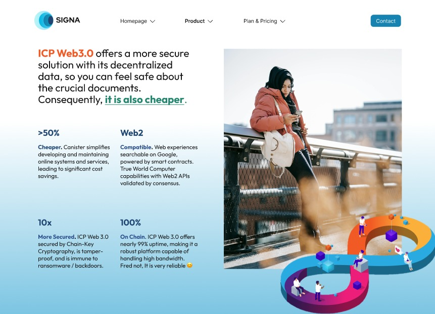

# Signa
Welcome to Signa, your trusted, decentralized, and easy to use document signing on the Blockchain. This project utilizes Internet Computer (ICP) as the main platform.

</a>

## Get Started

Before starting exploring this project, please try to understand how Internet Computer (ICP) works by reading this documents

- [Quick Start](https://internetcomputer.org/docs/current/developer-docs/setup/deploy-locally)
- [SDK Developer Tools](https://internetcomputer.org/docs/current/developer-docs/setup/install)

You might want to explore the project directory structure and the default configuration file. Working with this project in your development environment will not affect any production deployment or identity tokens.

## Running the project locally

For running the project locally, please follow these commands:

```bash
# Starts the replica, running in the background
dfx start --background

# Deploys your canisters to the replica and generates your candid interface
dfx deploy
```

Once the job completes, your application will be available on your localhost and DFX will returns the accessible address which looks like this `http://127.0.0.1:4943?canisterId={asset_canister_id}`.

## Developing

This project by default adopted monorepo paradigm where all projects centralized under 1 repo. If you take a look in the folder structure, under `/src` you will see `/signa_frontend` and `/signa_backend` which contains both frontend and backend code.

Tech stack that we used for this project
- Frontend
--- React
--- Vite

- Backend
--- Node v20
--- Typescript

### Making changes on Backend

Once you have done making changes on backend, you can redeploy your code by stopping current deployment and do `dfx deploy`. For now, no hot-reload configured.

### Making changes on Frontend

Frontend part is a bit unique, it doesn't need to be deployed through `dfx` to run. You can basically run the React project by calling

```bash
npm run dev
```

Which will start a server at `http://localhost:5173`, by default it will proxying API requests to the canister replica that runs at localhost port 4943.

## Testing Integration Between Frontend <> Backend

If you want to develop locally and want to test the integration between Frontend and Backend, what you need to do is run `dfx start` and then `dfx deploy`. Then dfx will provide the localhost url for Backend, Frontend and Internet Identity canister that you can access and test.